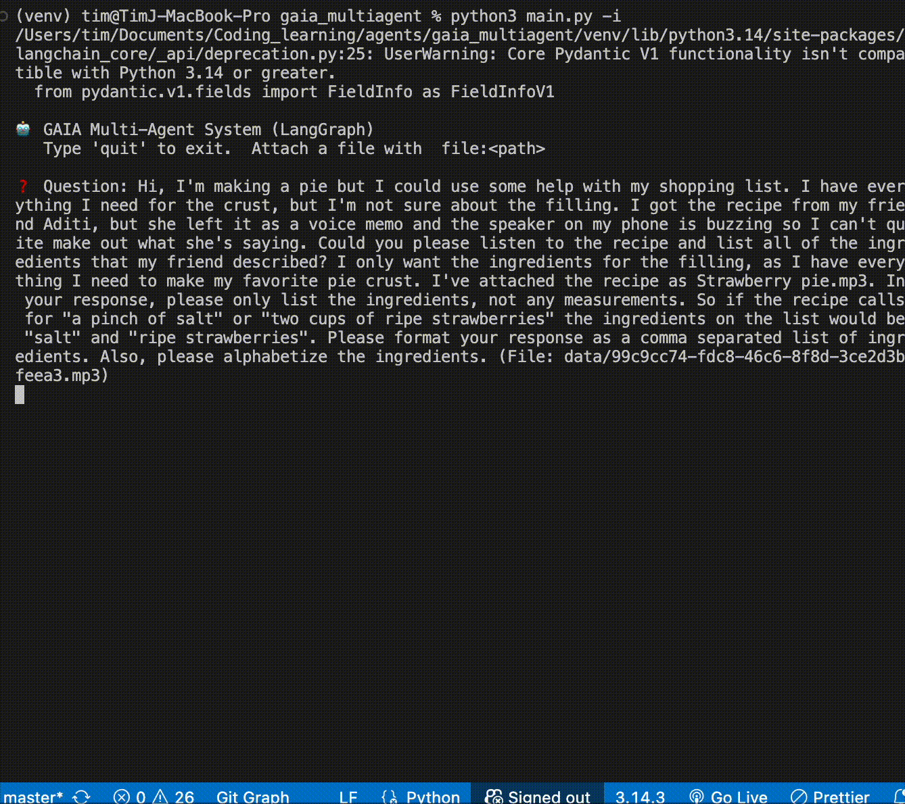
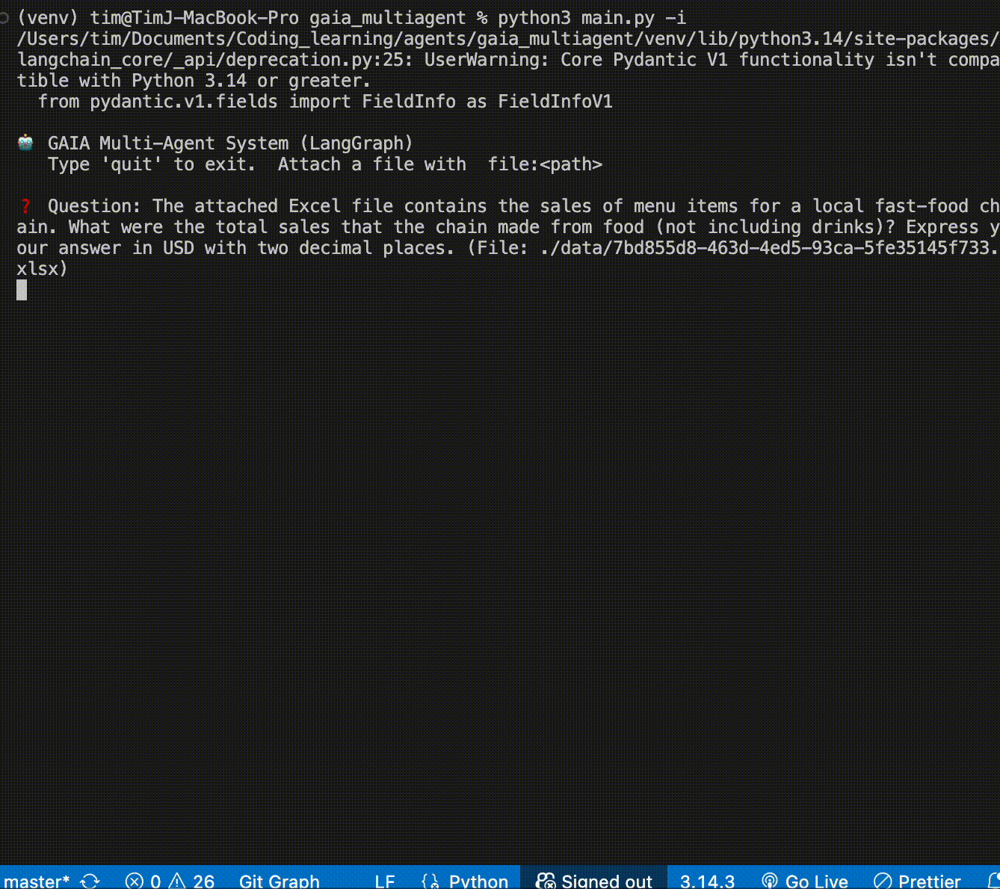
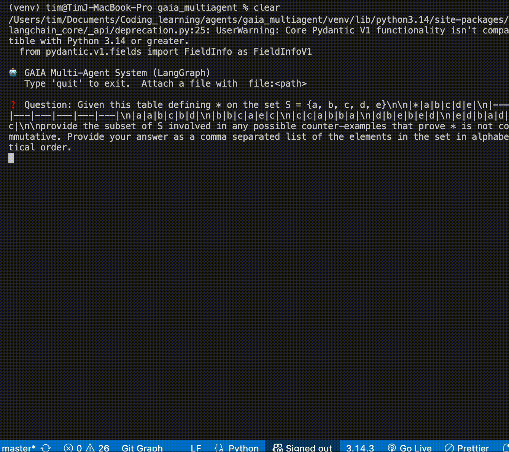
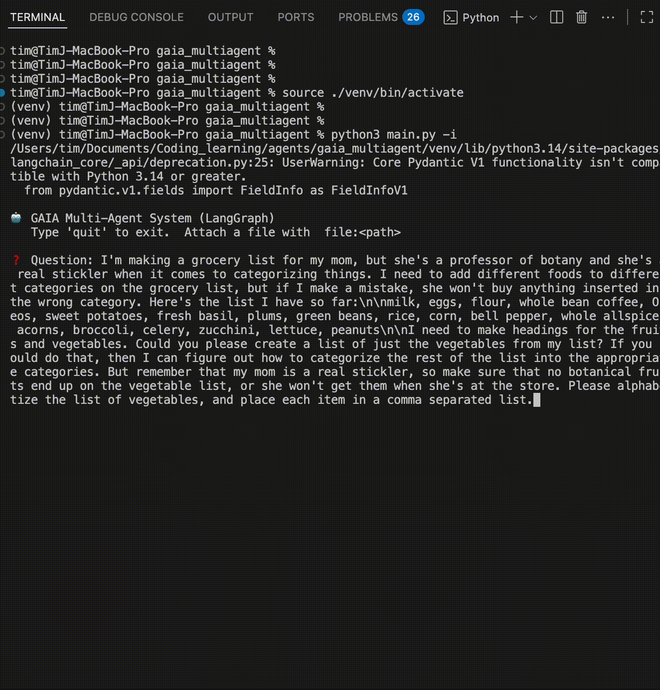
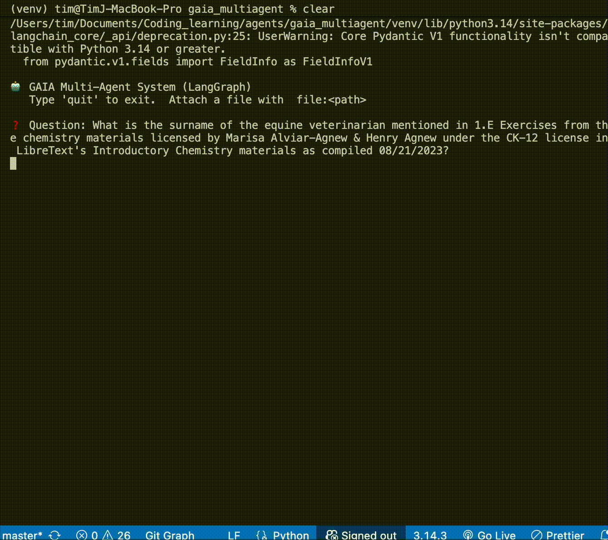
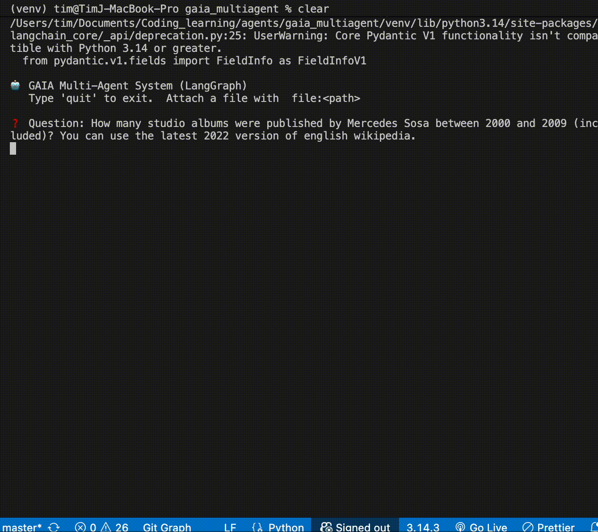
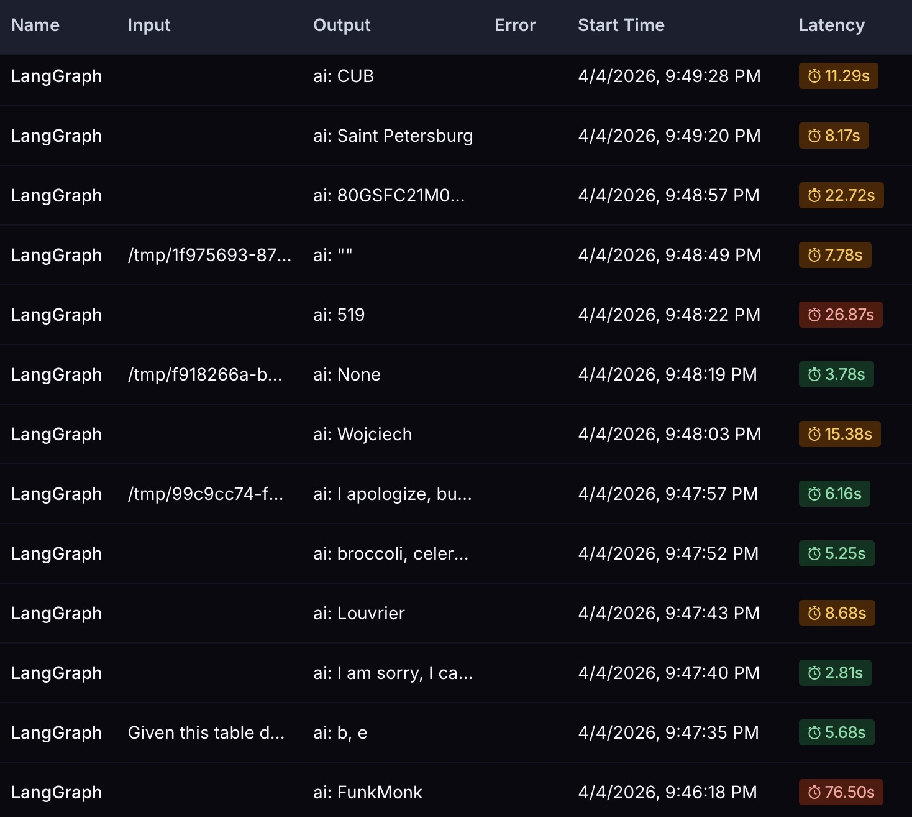

# GAIA Multi-Agent System (LangGraph)

This is a multi-agent system built with **LangGraph** to tackle the [GAIA benchmark](https://huggingface.co/spaces/gaia-benchmark/leaderboard).

**This project serves as my final assignment for the [Hugging Face Agents Course](https://huggingface.co/learn/agents-course/en), specifically the [Unit 4 Hands-on](https://huggingface.co/learn/agents-course/en/unit4/hands-on).**

**Current Performance: 85% (17/20) on Level 1**

- **Passed:** All web search tasks.
- **Issues:** File tests run perfectly on my local machine but fail during online evaluation because the Hugging Face datasets expire/go missing. Also, haven't implemented multimodal video evaluation yet.

## Architecture

The system uses a **Supervisor/Orchestrator** pattern. A lightweight, fast LLM acts as the router to classify the prompt, then hands the task off to specialized sub-agents powered by a heavier reasoning model.

- **Orchestrator:** Qwen/Qwen2.5-7B-Instruct
- **Sub-Agents & Finalizer:** Gemini-2.5-Flash
- **Traces** LangSmith

```text
┌────────────┐    ┌──────────────┐
│  classify  │───►│  researcher  │──┐
│  (router)  │───►│ mathematician│──┤
│            │───►│ file_analyst │──├──► [finalizer] ---> final_answer
│            │───►│  generalist  │──┘
└────────────┘    └──────────────┘
```

### Sub-Agents:

- **Researcher**: Built for deep web searches (Tavily) and fact retrieval (Wiki).
- **Mathematician**: Handles math problems using a calculator tool and dynamic Python execution.
- **File Analyst**: Triggered whenever a file is attached. Reads files, runs Python data scripts (like pandas for Excel), and parses audio/images.
- **Generalist**: The fallback agent for multi-step reasoning that doesn't fit cleanly into one bucket.
- **Answer Extraction(Finalizer)**: Align the model output with the evaluation benchmarks

### System Toolset(8)

#### **Researcher**

- **`tavily_search`**: High-fidelity web search with raw content extraction( raw_content, advanced mode, extract).
- **`wiki_search`**: Knowledge retrieval formatted in clean Markdown( search -> page -> Jina AI).

#### **Mathematician**

- **`calculator`**: Rapid evaluation of mathematical expressions.
- **`run_python`**: Environment for generating and executing dynamic scripts.

#### **File Analyst**

- **`read_file`**: Direct ingestion and parsing of local file data.
- **`execute_python`**: Execution of predefined Python scripts and local assets.
- **`run_python`**: Environment for generating and executing dynamic scripts.
- **`analyze_image`**: vision processing for image analysis.( Gemini 2.5 flash )
- **`transcribe_audio`**: Neural speech-to-text processing. ( Gemini 2.5 flash )

## Demos

Check out how the different sub-agents handle various tasks:

### Audio Transcription & Analysis



### Excel File Processing



### Mathematical Problem Solving



### General Reasoning



### Live Web Search



### Deep Wiki Search



### LangSmith Traces



## Key Updates & Optimizations

I tweaked the standard setup to fix a lot of the common formatting, context limit, and hallucination issues you usually see in these benchmarks:

1. **Wiki Extraction via Jina AI**  
   Standard Wikipedia search/loaders usually have formatting issues or aggressively cut off content. I routed Wiki searches through Jina AI to grab the entire page in clean Markdown.

2. **Aggressive Token Reduction**  
   Getting entire Wiki pages is great, but it eats the context window. I wrote a custom text cleaner (`_clean_wiki_content`) that strips out Jina metadata, image markdown, "See also"/References sections, and inline link noise while preserving the actual text and tables.

   **Result:** Cut token usage by ~50-65% per search.

   **Examples:**
   - 1928 Summer Olympics: 17,220 → **5,891 tokens** (65% reduction)
   - Giganotosaurus: 13,114 → **4,442 tokens** (66% reduction)
   - Mercedes Sosa: 15,818 → **7,950 tokens** (49% reduction)

3. **Tavily Deep Search**  
   Upgraded the Tavily tool to use `search_depth="advanced"` and `include_raw_content` to pull full page text instead of just snippets.

4. **Model Upgrade**  
   Swapped out Gemini Lite for **Gemini-2.5-Flash** across all sub-agents to significantly cut down on hallucinations during complex reasoning.

5. **Dual-mode Python subprocess execution with timeout handling**
   - Split Python execution into two tools: `execute_python` (for running existing local files) and `run_python` (for running scripts generated on-the-fly by the LLM).
   - Added auto-stripping for markdown backticks so generated Python code runs smoothly without syntax errors.
   - Added execution timeout to avoid hanging processes.

## How to Use

### Prerequisites

You'll need API keys for Google (Gemini), Hugging Face (Qwen routing), and Tavily (Search).

```bash
export HF_TOKEN="hf_your_token_here"
export GOOGLE_API_KEY="AIzaSy_your_key_here"
export TAVILY_API_KEY="tvly-your_key_here"
```

Install the required dependencies (LangGraph, LangChain, Google GenAI, etc.).

### Running the System

You can hit the entry point (`main.py`) in a few different ways:

1. **Single Query (CLI)**

```bash
python main.py -q "What is the population of Tokyo?"
```

2. **Query with an Attached File**

```bash
python main.py -q "Calculate the sum of the revenue column." -f "/path/to/financials.xlsx"
```

3. **Interactive Mode (REPL)**

```bash
python main.py -i
```

(To attach a file in chat, append `file:<path>` to your message.)

### Debug Mode

To see the ReAct loop thinking step-by-step and watch tool execution outputs, use the `-v` flag:

```bash
python main.py -q "Who won the 1928 olympics?" -v
```
